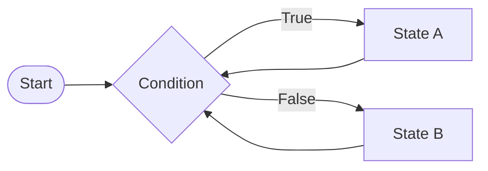
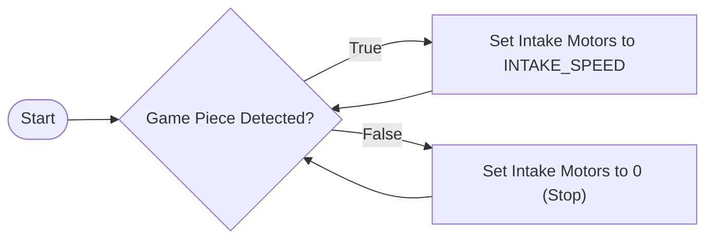

# Bang-Bang Control

## Use Cases
Bang-Bang control is a simple but effective control algorithm when used in the right context. It is most suited for applications where the system's behaviour can be easily achieved by switching the system on or off based on certain conditions. Here are some scenarios where Bang-Bang control may be used in FRC:

- Spinning the intake motors while a game piece is detected
- Turning on the shooter motors when a game piece is detected in the shooter mechanism

You'll notice that these use cases are all binary in nature, where the system's activation is based on whether a simple condition is met or not. Bang-Bang control will not be able to account for complex scenarios or where external factors may affect the system's behaviour. In those cases, more sophisticated control such as [PID](pid.md) should be considered instead.

## Theory


### Principle
Bang-Bang control is straightforward. You will continuously check if a condition is met or not. If the condition is met, you will switch the system to a certain state. If the condition is not met, you will switch the system to another state. Normally, this process will continue indefinitely, however, specific variants of Bang-Bang control may have additional conditions to stop the system, whether it be a sensor-based condition, a timeout, an interrupt, or something else.

### Signals
The devices you are controlling with Bang-Bang control will typically be motors or solenoids. Whatever the case, they need to support 2 states (generally on or off) that can be changed via code. For motors, this is usually either off or a predefined speed. For solenoids, this is usually either extended or retracted.

### Tolerance
It is rare for exact values to ever be achieved in real-world systems, and as such, it is important to account for this in your algorithms. For Bang-Bang control, if you were to switch the system on and off based on an exact value you're looking to achieve, it would result in the system constantly switching on and off as it overshoots and undershoots the target value. To prevent this, a tolerance value is usually used to give the system more time to settle before trying to correct it again. Depending on how fast the error changes, and how fine the corrections need to be, the tolerance value may need to be adjusted, a more sophisticated condition used, or a different control algorithm altogether.

## Sample Implementation
### Scenario
We have an intake mechanism with a sensor that detects if a game piece is present. We want to intake the game piece when it is detected, and stop intaking when it is no longer detected. We will be assuming a simplified intake sequence that only requires that a motor be turned on or off, although in a real-world scenario, you may need to consider movement of the intake mechanism, solenoids to control the game piece's position in the mechanism, etc.

### Flowchart


### Code
The sample code assumes that the periodic function is placed in a command, as this will allow it to run periodically without interfering with the event loop (rest of the code). This also allows for the command to be interrupted when needed, without a stop condition in the code. It is assumed that the sensor is an digital input with an open (`true`) and closed (`false`) state, and the intake motor's `.set()` method is used to set the motor speed. `INTAKE_SPEED` is assumed to be a constant predefined speed for the motor to intake the game piece.

```java
@Override
public void periodic() {
    if (sensor.get()) intakeMotor.set(INTAKE_SPEED);
    else intakeMotor.set(0);
}
```

## Helpful Links
- [Wikipedia](https://en.wikipedia.org/wiki/Bang%E2%80%93bang_control)
