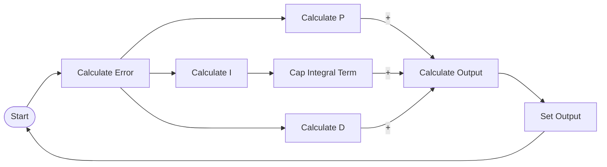
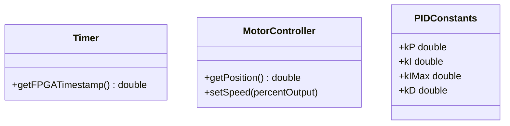

# PID Control

--8<-- "incomplete.md"

While math is inevitable when talking about PID, this documentation is designed to use as little math as possible, and instead focus on the practical and basic theoretical aspects of PID control. You can find more detailed information on the math behind PID in the [Helpful Links](#helpful-links) section.

## Use Cases
PID control, or Proportional-Integral-Derivative control, is a sophisticated & flexible control algorithm that is commonly used in scenarios where precise and efficient control of various mechanisms is needed. PID is able to account for a wide range of scenarios, including those where external factors may affect the system's behaviour. It can run until a certain condition is met, or run infinitely to maintain a certain state. Here are some scenarios where PID control may be used in FRC:

- Controlling the position of an arm or elevator mechanism
- Driving on a balancing mechanism until a certain angle is achieved
- Following a predefined path using a motion profile

You'll notice that these scenarios are more advanced than those where [Bang-Bang control](bang-bang.md) would be used.

## Theory


### Principle
For all equations, $e(t)$ is the error at time $t$, $K_p$ is the proportional gain, $K_i$ is the integral gain, $K_d$ is the derivative gain, and $t$ is the time. The result of the PID control algorithm is the sum of the three components ($\text{output} = P(t) + I(t) + D(t)$)

#### P (Proportional)
$$
P(t) = K_p\cdot e(t)
$$

The proportional term is the most straightforward of the three components. It is simply the error multiplied by a constant gain. The proportional term is responsible for the immediate response of the system to changes in the error. A higher proportional gain will result in a faster response to changes in the error, but may also result in overshooting the target value.

The proportional term is what provides most of the output in the PID controller. The integral and derivative terms are used to fine-tune the output, and allow the system to respond to changes more effectively, but the proportional term is what provides the bulk of the output.

**SIMPLIFIED**: The proportional term directly scales the error to the output based on a constant. The relationship between the error and the P term output is linear. A higher constant will result in a more aggressive response to the error, but may also result in overshooting the target value.


???+ note "Graph"

    ```vegalite
    {
        "title": "Sample Proportional Output vs Error Graph",
        "data": {
            "values": [
                {"error": 0, "output": 0},
                {"error": 10, "output": 5},
                {"error": 20, "output": 10}
            ]
        },
        "mark": "line",
        "encoding": {
            "x": {"field": "error", "type": "quantitative", "title": "Error", "axis": {"labels": false}},
            "y": {"field": "output", "type": "quantitative", "title": "Proportional Output", "axis": {"labels": false}}
        }
    }
    ```

#### I (Integral)
$$
I(t) = K_i\cdot\int_0^t e(\tau) d\tau
$$

The integral term is used to account for the accumulated error over time. It is the sum of the error over time, multiplied by a constant gain. The integral term is responsible for correcting any steady-state error that may be present in the system. A higher integral gain will result in a faster correction of steady-state error, but may also result in overshooting the target value.

**SIMPLIFIED**: The integral term accumulates the error over time, which allows the system to overcome any resistances that may be present.

???+ note "Graph"

    ```vegalite
    {
        "title": "Sample Position vs. Time Graph",
        "data": {
            "values": [
                {"legend": "Setpoint", "time": 0, "position": 4},
                {"legend": "Setpoint", "time": 4, "position": 4},
                {"legend": "System wo/ Integral", "time": 0, "position": 0},
                {"legend": "System wo/ Integral", "time": 0.5, "position": 3.5},
                {"legend": "System wo/ Integral", "time": 4, "position": 3.5},
                {"legend": "System w/ Integral", "time": 0, "position": 0},
                {"legend": "System w/ Integral", "time": 0.5, "position": 3.5},
                {"legend": "System w/ Integral", "time": 1, "position": 4},
                {"legend": "System w/ Integral", "time": 4, "position": 4}
            ]
        },
        "mark": {
            "type": "line",
            "interpolate": "monotone"
        },
        "encoding": {
            "x": {"field": "time", "type": "temporal", "title": "Time", "axis": {"labels": false}},
            "y": {"field": "position", "type": "quantitative", "title": "Position", "axis": {"labels": false}},
            "color": {"field": "legend", "type": "nominal", "title": "Legend"}
        }
    }
    ```

    In this sample graph, we are assuming that there is resistance present in the system that is not accounted for in the P term, and in the system with the integral term, it is well-tuned. As can be seen, the system without the integral term is unable to reach the setpoint, and instead has a steady-state error. The system with the integral term, however, is able to accumulate the error over time, which allows it to overcome the resistance and reach the setpoint.

!!! example

    Consider a PID controller with only a P term that is being used to drive a set distance. If we encounter a slight uphill slope that was not accounted for in the P term, the output may not be high enough to overcome the resistance. Now, if we were to add an I term, it would accumulate the error over time, which slowly increases the output, allowing the system to overcome the resistance.

##### Integral Windup
Integral windup is a phenomenon that causes the integral term to build up an unexpectedly large value. This can happen when the system does not respond quickly enough to correct a large error. This results in the output of the PID controller being excessively high, which can cause the system to go too fast, overshoot the target value, or similar.

There are multiple methods that can be used to mitigate the problem of integral windup. However, **the most common method we use in FRC is to cap the integral term at a specific value**, which we do not want it to exceed. This will prevent the integral term from building up an excessively large value that we are not able to handle, however will limit its ability to correct for large resistances.

???+ note "Graph"

    ```vegalite
    {
        "title": "Sample Position vs. Time Graph",
        "data": {
            "values": [
                {"legend": "Setpoint", "time": 0, "position": 4},
                {"legend": "Setpoint", "time": 4, "position": 4},
                {"legend": "Setpoint", "time": 4, "position": 2},
                {"legend": "Setpoint", "time": 8, "position": 2},
                {"legend": "System w/ Integral (Capped)", "time": 0, "position": 0},
                {"legend": "System w/ Integral (Capped)", "time": 0.5, "position": 4},
                {"legend": "System w/ Integral (Capped)", "time": 4, "position": 4},
                {"legend": "System w/ Integral (Capped)", "time": 4.5, "position": 2},
                {"legend": "System w/ Integral (Capped)", "time": 8, "position": 2},
                {"legend": "System w/ Integral (Uncapped)", "time": 0, "position": 0},
                {"legend": "System w/ Integral (Uncapped)", "time": 0.5, "position": 4.2},
                {"legend": "System w/ Integral (Uncapped)", "time": 0.75, "position": 3.95},
                {"legend": "System w/ Integral (Uncapped)", "time": 1, "position": 4},
                {"legend": "System w/ Integral (Uncapped)", "time": 4, "position": 4},
                {"legend": "System w/ Integral (Uncapped)", "time": 4.5, "position": 1.80},
                {"legend": "System w/ Integral (Uncapped)", "time": 4.75, "position": 2.05},
                {"legend": "System w/ Integral (Uncapped)", "time": 5, "position": 2},
                {"legend": "System w/ Integral (Uncapped)", "time": 8, "position": 2}
            ]
        },
        "mark": {
            "type": "line",
            "interpolate": "monotone"
        },
        "encoding": {
            "x": {"field": "time", "type": "temporal", "title": "Time", "axis": {"labels": false}},
            "y": {"field": "position", "type": "quantitative", "title": "Position", "axis": {"labels": false}},
            "color": {"field": "legend", "type": "nominal", "title": "Legend"}
        }
    }
    ```

    In this sample graph, we are assuming that there is little resistance present in the system that is not accounted for in the P term, and the integral gain is on the high side. As can be seen, the system with the uncapped integral term overshoots the setpoint. This is a result of integral windup, and can be [mostly] mitigated by capping the integral term (or using other measures), as shown in the capped variant, where there is little to no overshooting.

#### D (Derivative)
$$
D(t) = K_d\cdot\frac{de(t)}{dt}
$$

The derivative term is used to account for the rate of change of the error. It is the derivative of the error with respect to time, multiplied by a constant gain. The derivative term is responsible for smoothing out the response of the system to changes in the error. A higher derivative gain will result in a faster response to changes in the error, but may also result in oscillations around the target value.

By smoothing out the response with the derivate term, we are also able to use a higher proportional gain (P term) which would allow the system to respond faster to the error. The derivative term will then slow down the system as it approaches the target value, which prevents the system from overshooting, even with this aggressive response. This is commonly used in applications where time to reach the target value is important, but we still want to avoid overshooting (and thus, time to correct), as much as possible.

**SIMPLIFIED**: The derivative term calculates the rate of change of the error, which allows the system to adjust the output for a smoother response. Essentially, as the error approaches the target value, the derivative term will reduce the output to prevent overshooting.

???+ note "Graph"

    ```vegalite
    {
        "title": "Sample Position vs. Time Graph",
        "data": {
            "values": [
                {"legend": "Setpoint", "time": 0, "position": 1},
                {"legend": "Setpoint", "time": 6, "position": 1},
                {"legend": "Underdamped", "time": 0, "position": 0},
                {"legend": "Underdamped", "time": 0.4, "position": 1.6},
                {"legend": "Underdamped", "time": 0.8, "position": 0.7},
                {"legend": "Underdamped", "time": 1.2, "position": 1.15},
                {"legend": "Underdamped", "time": 1.6, "position": 0.925},
                {"legend": "Underdamped", "time": 2, "position": 1.0375},
                {"legend": "Underdamped", "time": 2.4, "position": 0.98125},
                {"legend": "Underdamped", "time": 2.8, "position": 1},
                {"legend": "Underdamped", "time": 6, "position": 1},
                {"legend": "Critically Damped", "time": 0, "position": 0},
                {"legend": "Critically Damped", "time": 3, "position": 1},
                {"legend": "Critically Damped", "time": 6, "position": 1},
                {"legend": "Overdamped", "time": 0, "position": 0},
                {"legend": "Overdamped", "time": 5.5, "position": 1},
                {"legend": "Overdamped", "time": 6, "position": 1}
            ]
        },
        "mark": {
            "type": "line",
            "interpolate": "monotone"
        },
        "encoding": {
            "x": {"field": "time", "type": "temporal", "title": "Time", "axis": {"labels": false}},
            "y": {"field": "position", "type": "quantitative", "title": "Position", "axis": {"labels": false}},
            "color": {"field": "legend", "type": "nominal", "title": "Legend", "legend": {
                "values": ["Setpoint", "Underdamped", "Overdamped", "Critically Damped"]
            }}
        }
    }
    ```

    In this sample graph, we are assuming that we have an aggressive proportional gain. The different lines represent different amounts of damping (from the derivative term) being applied, and how it affects the system's response.

    - **Underdamped**: Can occur when an aggressive proportional gain is set, with an insufficiently large derivative gain (damp). Results in oscillations around the set point, until settled.
    - **Overdamped**: Can occur when the derivative gain (damp) is too large for the proportional gain. Results in a longer than necessary time to reach the set point.
    - **Critically Damped**: A well-tuned derivative term (damp) for the proportional term.

!!! example

    Consider a PID controller with only a P term that is being used to drive a set distance. If we encounter a sudden downhill slope that was not accounted for in the P term, the output may be too high, causing the system to overshoot the target value. Now, if we were to add a D term, it would calculate the rate of change of the error, which would reduce the output as the error approaches the target value, slowing it down and preventing overshooting.

### Signals
#### Input
The input to a PID controller should be the error of the system. The error is the difference between the desired value and the actual value of the system. The error can be calculated using sensors, encoders, or other feedback mechanisms that provide information about the system's state. A common use case of PID, to reach a desired motor position, uses the difference between the desired position of the motor in encoder ticks (set point) and the current position of the motor in encoder ticks (feedback).

#### Output
The output of a PID controller is a variable value that is used to control the system. The device being controlled should be able to accept this variable value and adjust its state accordingly to achieve the intended effect. For example, motors, which are one of the most common use cases of PID, can accept the output of the PID controller as a percent speed value.

## Tuning
The output of PID control needs to be adjusted to achieve the expected system response. This is done by tuning the three constants involved in PID, $K_p$, $K_i$, and $K_d$. It is unlikely that estimated values for these constants will work well, and as such, a tuning process with the actual system is required to find the optimal values. This section of the documentation will cover the process of tuning a PID controller.

### Setpoints

The process of obtaining setpoints will differ depending on the input used for the PID controller. Generally, if it cannot be theoretically determined, it will consist of logging the input value continuously, physically manipulating the robot to the desired position, and recording the value. This should be done numerous times, with an average measurement taken to ensure an accurate reading.

In FRC, using PID to reach (and/or hold) a particular motor position is common. While the setpoint for this *could* be theoretically determined with knowledge of the distance corresponding to each encoder tick (taking into account gearboxes and other physical attributes), this is often inaccurate as a result of real world conditions. Instead, it is highly suggested to experimentally determine the setpoint by following the above process: logging the encoder value, manually moving to that position, and recording the encoder value to use as the setpoint.

!!! tip

    If you see during tuning that the system is constantly moving to the wrong position, it may be worth checking that the setpoint is accurate. If it is accurate, ensure that the encoder is properly zeroed in the expected position, and that shifts are not occurring in the gearbox or other mechanisms that could affect the encoder reading.

### Initial Estimates
#### P (Proportional)
A good starting point for the proportional gain is to take the maximum expected error, and ensure that will correspond to the maximum expected output of the system. This can be later adjusted to be higher or lower, depending on how the system responds.

Or, mathematically, where $K_{p}$ is the initial proportional gain, $e_{max}$ is the maximum expected error, and $o_{max}$ is the maximum expected output of the system:

$$
K_{p} = \frac{o_{max}}{e_{max}}
$$

!!! example

    If we are using a PID controller to control the position of a motor, taking difference in position as the input, and motor percent speed as the output, the maximum expected error would usually be the distance between the setpoint, and the furthest possible position. The expected output would usually be `1.0` (100%).

    If the maximum expected difference were 100 encoder ticks, then to calculate the initial $K_p$ value, we would use the following calculation: $K_{p} = \frac{1.0}{100} = 0.01$, resulting in an initial value of `0.01`.

If the application of the PID controller does not allow for a good estimate of the initial proportional gain, it is suggested to start with a low value, and increase it gradually until the system responds as expected. This prevents potentially hazardous situations that could arise from an extremely aggressive response.

#### I (Integral) and D (Derivative)
Usually, the integral and derivative gains are set to zero initially, and are only adjusted as needed during the tuning process. This is because the integral and derivative terms are used to fine-tune the output of the system, or account for specific scenarios, and may not necessarily be needed in all cases. It should be obvious during the tuning process if the integral or derivative terms are needed, at which point they can be adjusted accordingly.

### Tuning Process
Put simply, the process of tuning PID consists of testing the system, adjusting the constants based on the system's behaviour, and repeating until the system responds as expected. Knowing what constants to adjust, and by how much is a skill that comes with experience, and is not something that can be easily taught. However, the following guidelines can be used to help you get started:

1. **Start with the Proportional Gain**: The proportional gain is the most important of the three constants, and should be adjusted first. Start with the [initial estimate](#initial-estimates), and adjust it until the system responds as expected.
    - If the system moves slowly, or stalls often before reaching the setpoint, try increasing the proportional gain.
    - If the system overshoots the setpoint by a large amount, or oscillates around the setpoint, try decreasing the proportional gain.
2. **Evaluate the Integral Term**: If the system is expected to encounter resistance that the proportional term cannot overcome, or if it is observed that there is a steady-state error, the integral term should be implemented. Start with a low value, and increase it until the system responds as expected.
    - If the system does not appear to be compensating enough for resistance, try increasing the integral gain.
    - If the system overshoots the setpoint, or oscillates around the setpoint, try decreasing the integral gain.
3. **Evaluate the Derivative Term**: If the system is tuned aggressively, and it is observed that the system often overshoots the setpoint, or the speed of the system nearing the setpoint is too high, the derivative term should be implemented. Start with a low value, and increase it until the system responds as expected.
    - If the system is still moving too fast, overshoots the setpoint, or oscillates around the setpoint, try increasing the derivative gain.
    - If the system moves slowly, or stalls often before reaching the setpoint, try decreasing the derivative gain.
4. **Repeat**: After adjusting the constants, test the system again, and repeat the process by adjusting & fine-tuning the constants until the system works well consistently under all conditions.

## Sample Implementation
### Scenario
We have an arm mechanism with a motor attached at a pivot point. We want the arm to be able to move to a specific angle (motor position), and hold that position against gravity or other resistances.

### Flowchart
As PID control mostly varies not in implementation, but in the constants used, the flowchart provided in the [Theory](#theory) section would still be representative of this sample scenario.

### Code
We will not be using the premade PID classes provided by WPILib, nor our own generic PID classes. Instead, we will be showing the relevant segments of a simple from-scratch PID controller that would be suitable for this use case. This should give you a better understanding of how PID works, and how it can be implemented or modified to suit your needs.

We will be referencing a few other classes that are not shown here, such as the `Timer` class, provided by WPILib, to get the time, the `Controller` class, which represents a standard motor controller, and `PIDConstants`, which represents some class containing the necessary constants for the PID controller. The following class diagram shows the classes we will be using:



Please note that the following code segment **is not complete**, is more verbose than necessary, and only shows the parts relevant for PID logic. An actual implementation would necessitate additional code for Command-Based interaction, logging, QoL features (such as on-the-fly adjustment), and more.

```java
private final Timer timer;
private final MotorController motor;
private final PIDConstants constants;

private double errorSum = 0; // (1)!
private double lastRunTime = 0; // (2)!
private double lastError = 0; // (3)!

// ...

@Override
public void execute() {
    if (lastRunTime == 0) lastRunTime = Timer.getFPGATimestamp(); // (4)!

    // Calculate time since the last execution
    final double currentTime = Timer.getFPGATimestamp();
    final double dt = currentTime - lastRunTime;

    // Calculate the error and error rate
    final double error = setpoint - motor.getPosition(); // (5)!
    final double errorRate = (error - lastError) / dt; // (6)!

    // Accumulate the error
    errorSum += error * dt; // (7)!
    errorSum = Math.max(-constants.kIMax, Math.min(constants.kIMax, errorSum)); // (8)!

    // Record values for next execution
    lastRunTime = currentTime;
    lastError = error;

    // Calculate the PID output
    final double p = constants.kP * error;
    final double i = constants.kI * errorSum;
    final double d = constants.kD * errorRate;
    final double output = p + i + d;

    // Set the motor speed
    motor.setSpeed(output);
}
```

1. Used to accumulate the error over time, for the integral term.
2. Used to calculate the time since the last execution, for the derivative term.
3. Used to calculate the rate of change of the error, for the derivative term.
4. Prevents a large delta time value on the first execution, which would result in a large derivative term output.
5. The error (difference between the setpoint and the current position) is used to calculate the proportional term. Remember that the proportional term is the error multiplied by a constant gain.
6. The rate of change of the error is used to calculate the derivative term. Remember that the derivative term is the rate of change of the error, multiplied by a constant gain.
7. Accumulates (sums) the error throughout the execution. We multiply the current error by the time, and add it to a running total, which is used to calculate the integral term. Remember that the integral term is the sum of the error over time, multiplied by a constant gain.
8. We cap the integral term in a bound of `-kIMax` to `kIMax`. This is to prevent integral windup, where the integral term builds up an unexpectedly large value. You can read more about this in [Integral Windup](#integral-windup).

## Helpful Links
- [Wikipedia](https://en.wikipedia.org/wiki/PID_controller)
- [FRC Documentation](https://docs.wpilib.org/en/stable/docs/software/advanced-controls/introduction/introduction-to-pid.html)
- Video Guide (by FRC Team 6814):
    - [Part 1](https://www.youtube.com/watch?v=jIKBWO7ps0w)
    - [Part 2](https://www.youtube.com/watch?v=Z24fSBVJeGs)
- [WPILib PID Implementation](https://docs.wpilib.org/en/stable/docs/software/commandbased/pid-subsystems-commands.html)
- [Sample Custom Generic PID Command](https://github.com/AgincourtSkunkworks/FRC2024/blob/31543ad1b67ef74d72f260e6cbaaed4dfaab8256/src/main/java/frc/robot/commands/GenericPID.java)

<!-- Definitions -->
*[setpoint]: The desired value that the system should reach.
*[setpoints]: The desired value that the system should reach.
*[set point]: The desired value that the system should reach.
