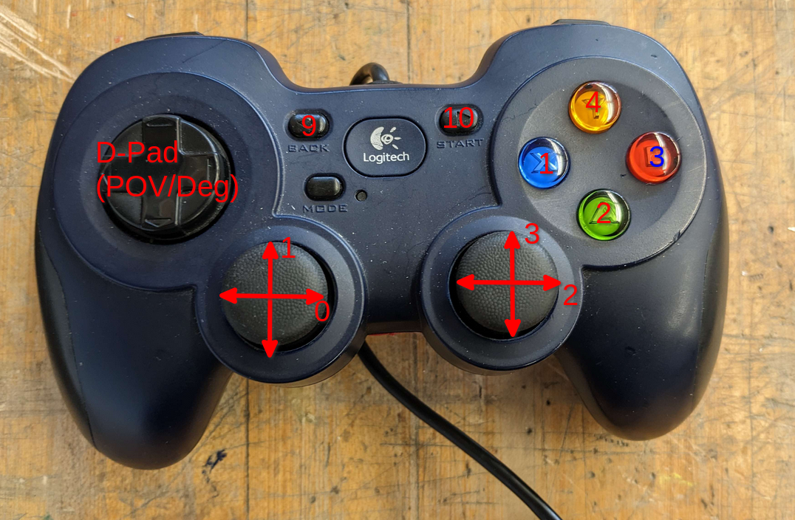
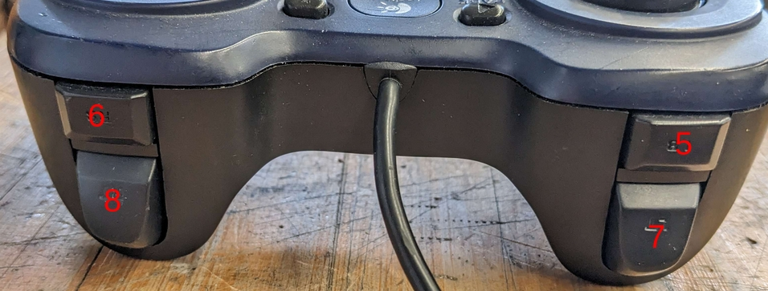

# Controller
--8<-- "outdated.md"

[Official Documentation - Basic](https://docs.wpilib.org/en/stable/docs/software/basic-programming/joystick.html)  
[Official Documentation - Command-Based](https://docs.wpilib.org/en/stable/docs/software/commandbased/binding-commands-to-triggers.html)

## Code
Here is some basic template code for the initialization of a controller object, as well as how to get the value of an axis:

```java
import edu.wpi.first.wpilibj.Joystick;

Joystick controller = new Joystick(id); //(1)

// To get the value of an axis:
controller.getRawAxis(id); //(2)
```

1. `id` can be obtained in the Driver Station under the USB devices tab (ID on the left of the controller name)
2. The `id` for axes can be seen in the [image below](#ids), look at the numbers next to the arrows on the joysticks

WPILib has great support for binding to controller buttons, using various methods on a `JoystickButton` object. Here are some examples:

```java
// `controller` is a Joystick object, and `id` is the ID of the button.
JoystickButton button = new JoystickButton(controller, id);

// Runs when the button changes from `false` to `true` (initially pressed) - command is scheduled once
button.onTrue(command);
// Runs while the button is `true` (pressed) - command is rescheduled whenever it ends, until the button is no longer pressed
button.whileTrue(command);
// Runs the command when the button changes from `false` to `true` (initially pressed), and cancels it when the button changes from `false` to `true` again (repressed)
button.toggleOnTrue(command);
```

!!!tip

    You are able to *chain* the methods used to bind to a button, which allows you to quickly create multiple bindings for the same button:

    ```java
    new JoystickButton(controller, id).onTrue(someCommand).onFalse(anotherCommand);
    ```

You can [debounce](https://en.wiktionary.org/wiki/debounce) the controller buttons if needed by adding a `.debounce(time)` before the binding, for example:
```java
button.debounce(0.1).onTrue(command);
```

## IDs
The two images below show the button, and axes IDs for the controller that we use. This may change if we switch controllers.



